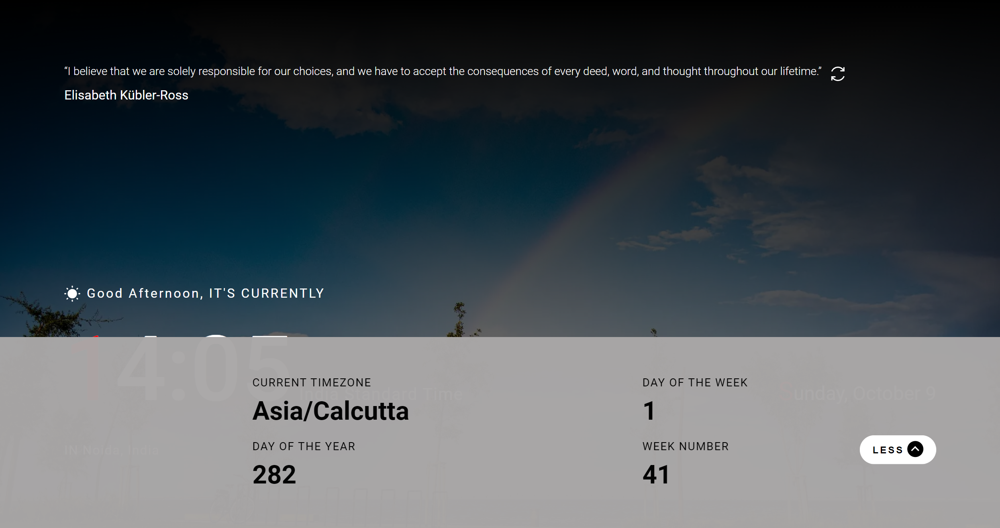

# Codedamn Community Projects - Digital Clock App

This is a Codedamn guided project where you will build a digital clock screensaver app. This Project is build in react and uses external apis to get some additional data.

## Instructions

Your challenge is to design this page and integrate quotable api to get random quote and ipv6 with geolocation to get city name (Also can be done using HTML Geolocation API).

This Project focuses on React, but you can use any tools you like to help you complete the project. So if you've got something you'd like to practice, feel free to give it a go.

### Landing Page

1. Landing page should have a random quote at the top with a refresh button.
2. It should have a dynamic background image according to the time.
3. It should have a clock at the bottom of the screen with some other information like Day, Month, Date
4. It should also show a dynamic greeting message.
5. Finally it should show user's location with a More information toggle button.
6. You can either use given 3rd party apis to get user location or also can use JS Geolocation API and get data after user's consent which is more precise then using apis.

### Bottom Panel

1. It should show a bottom panel on button click.
2. Bottom panel should have some additional date time information.

### Recommended Technologies

1. React.js
2. Javascript
3. HTML/CSS

### Third party API

1. [Quotable](https://api.quotable.io/random) API to get random quote.
2. [JSONIP](https://ipv6.jsonip.com/) to get user's ipv6.
3. [Geolocation DB](`https://geolocation-db.com/json/2405:201:400f:d1a0:55be:921f:a1ec:8080`) to get user's location information.

### Where to find everything

Your task is to build out the project as per the provided screenshots. You will find both a mobile and a desktop version of the design.

The designs are in image formats can be found in `/designs`.

You will find all the required images in the `/public` folder.
